# ygo-cards-variational-autoencoder-burn
Implementation of a variational autoencoder to test the deep learning framework Burn

## Results

In general, the VAE fail at generating the complex structures found in yu-gi-oh cards. Interestingly, there seems to be a compromise between image quality and global image coherence when adjusting the weight between the reconstruction loss and the distribution loss that ensures generated images follow the distribution of training images.

Here are illustration for different values:

### Reconstruction

| distribution weight | 1 | 0.1 | 0.01 |
|---------------------|--------------------------------------------------------------|----------------------------------------------------------------------------------|----------------------------------------------------------------|
| Image 1             | 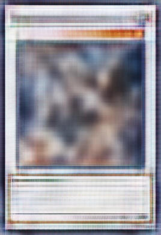 | 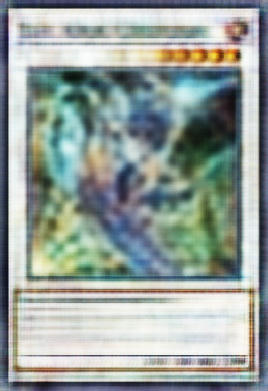| 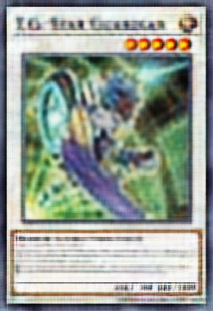|
| Image 2             |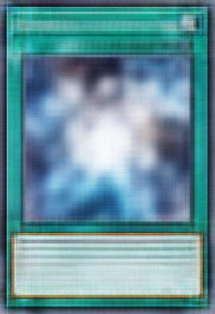 | 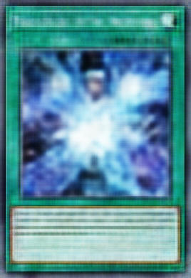| 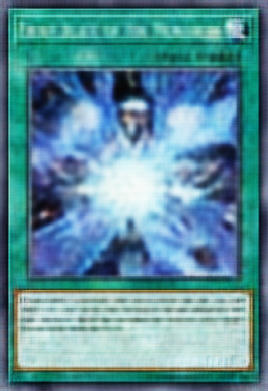|

### Generation

| distribution weight | 1 | 0.1 | 0.01 |
|---------------------|----------------------------------------------------------|-----------------------------------------------------------|-----------------------------------------------------------|
| Image 1             | 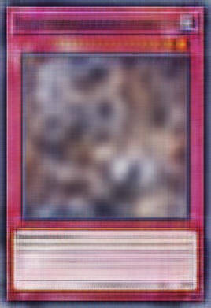 | 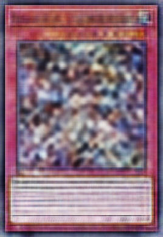| 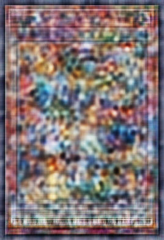|
| Image 7             | 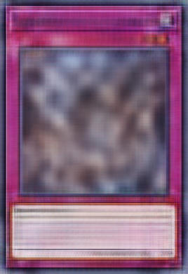 | 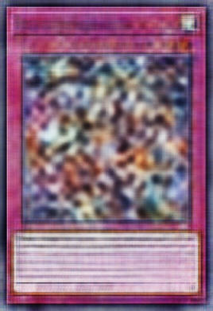| 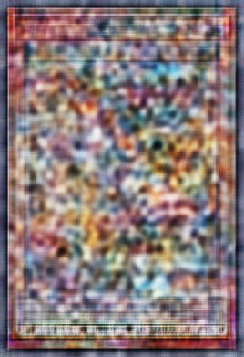|

## Requirements

uv

rustc

cargo

## Usage

### Setup the data

$ cd data

$ uv run download_images.py 

$ uv run exclude_invalid.py 

$ chmod +x create_test_set.sh

$ ./create_test_set.sh

### Start training

$ cd ..

$ cargo run --release

The model will train and generate reconstructed images as well as new images sampled from the approximated training distribution.
